# 🐰 SillyBunny 🐰
<div>

</div>

---

An elegant fork of [SillyTavern](https://github.com/SillyTavern/SillyTavern), designed with a cleaner, graphical shell UI; Bun-based backend; built-in tutorials, presets, extensions, and a quick-start dashboard; and a lightweight agentic system to facilitate modern agent functionality.

> [!WARNING]
> This is an in-dev fork, and is considered beta quality. [Please direct SillyBunny-specific issues to this project's issue tracker.](https://github.com/platberlitz/SillyBunny/issues) If an issue is reproducible in upstream SillyTavern, please report it upstream instead.
>
> Disclaimer: LLMs are used to facilitate development of this fork. Overall software design, prompting, testing, and documentation are handled by humans. To keep things simple, we try to maintain close to upstream as possible.

<details>
<summary><h2>Screenshots</h2></summary>

These screenshots show the graphical shell UI across Workspace, Customize, Agents, Characters, Search, and a Bunny Guide in-chat view on desktop and mobile.

#### Desktop

| Desktop Workspace Menu | Desktop Customize Menu |
| :---: | :---: |
| 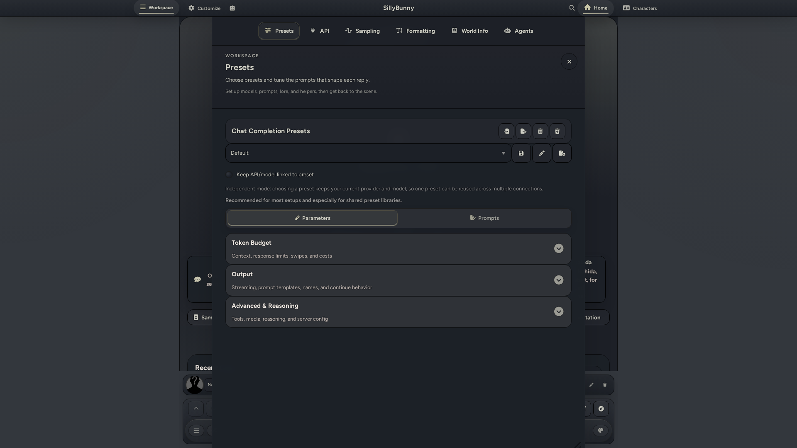 | 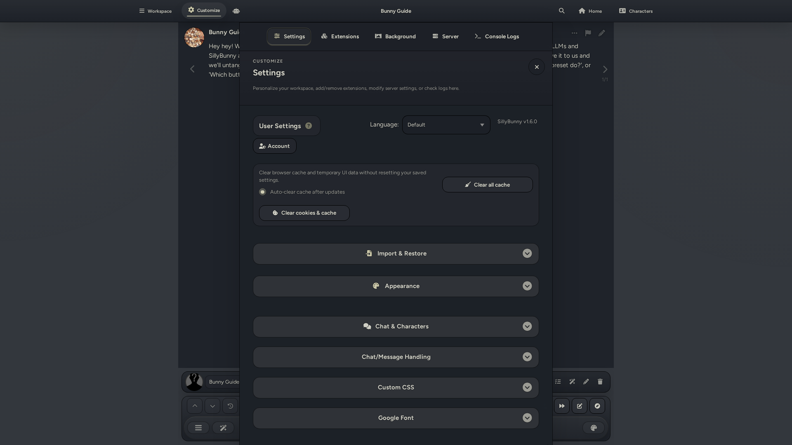 |

| Desktop Agents Menu | Desktop Characters Menu |
| :---: | :---: |
| 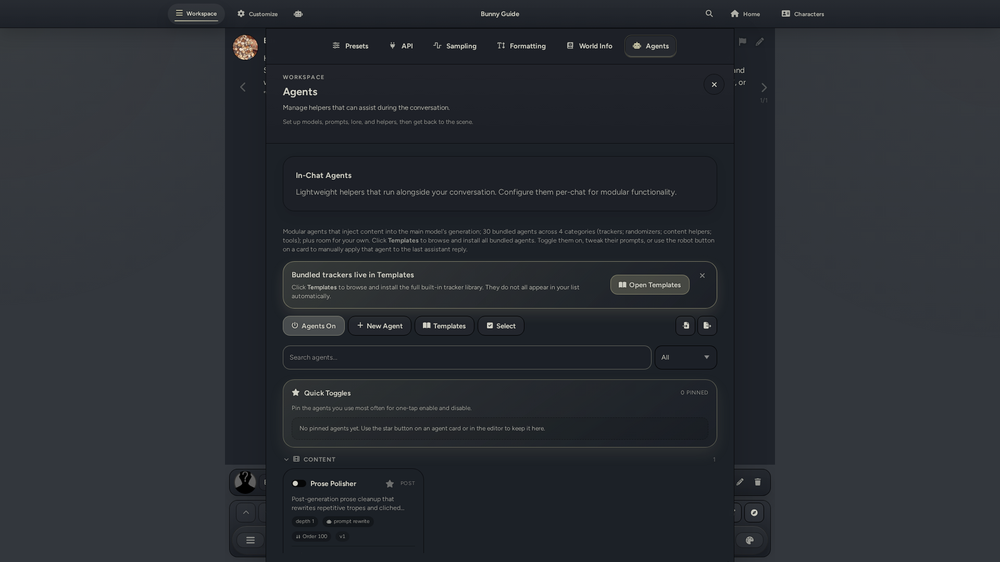 | 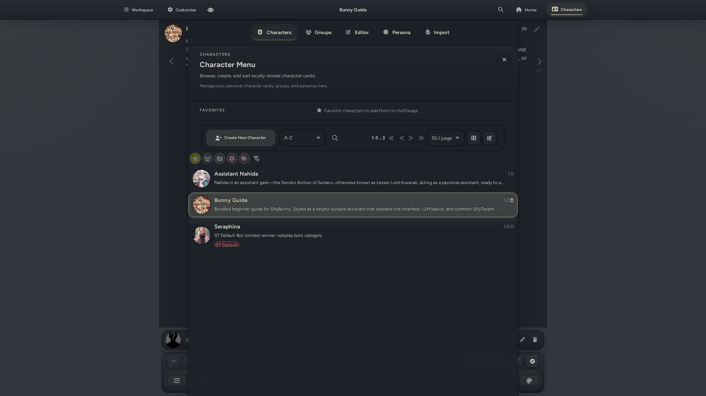 |

| Desktop Search | Desktop Chat |
| :---: | :---: |
| 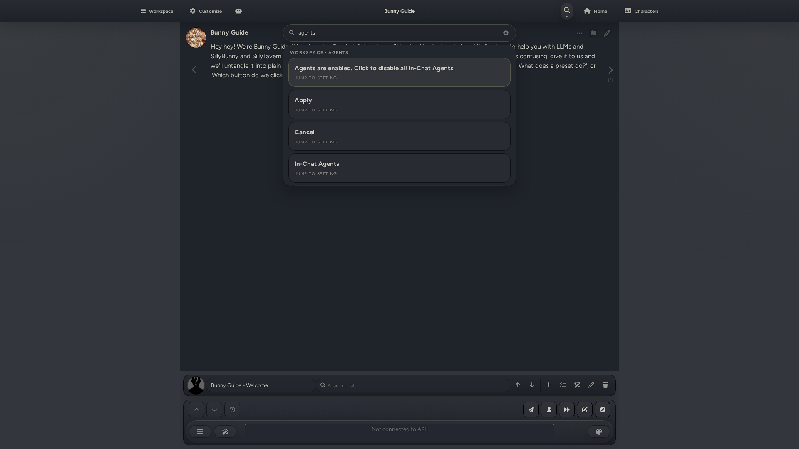 | 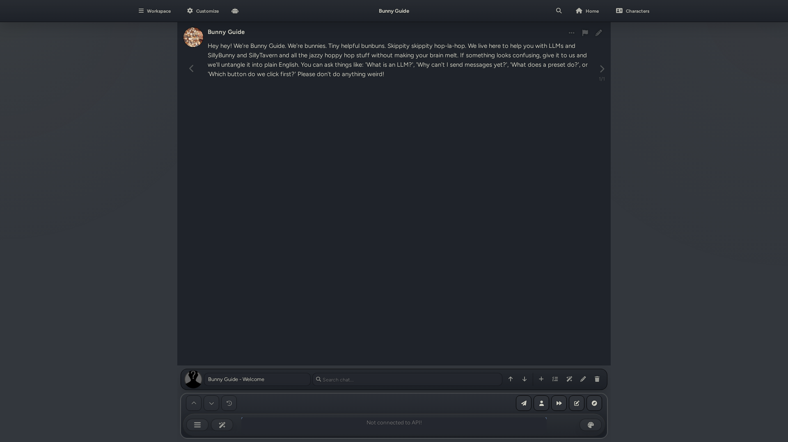 |

#### Mobile

| Mobile Workspace Menu | Mobile Customize Menu | Mobile Agents Menu |
| :---: | :---: | :---: |
| 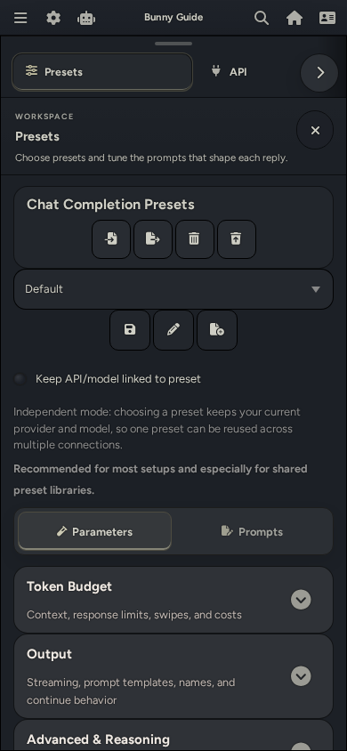 | 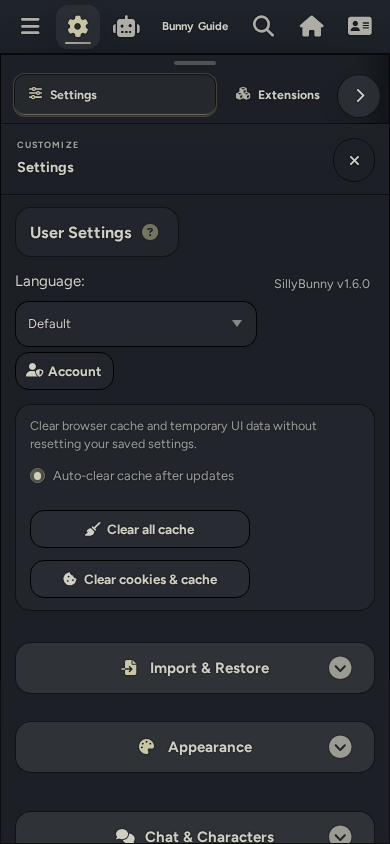 | 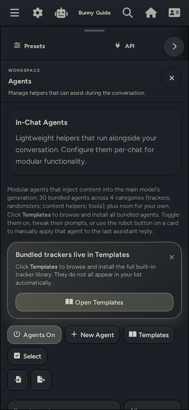 |

| Mobile Characters Menu | Mobile Search | Mobile Chat |
| :---: | :---: | :---: |
| 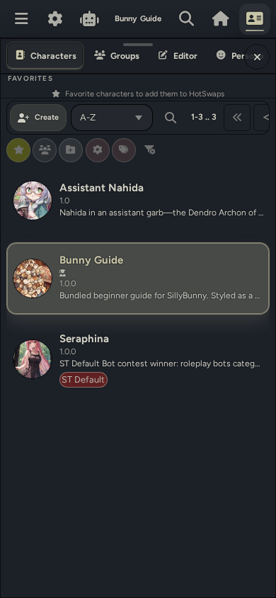 | 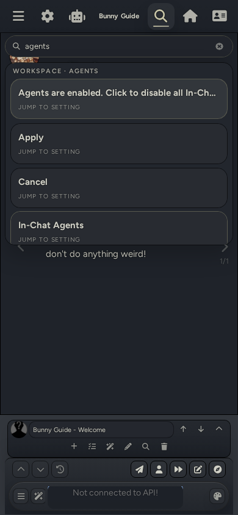 | 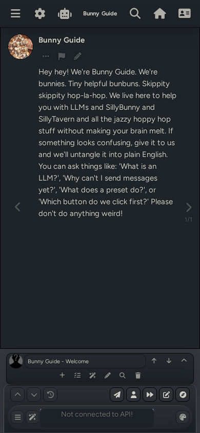 |

</details>

---

## Table of Contents
* [At a Glance](#at-a-glance)
* [Installation](#installation)
    * [macOS Notes](#macos-notes)
    * [Termux (Android) Notes](#termux-android-notes)
    * [Update Instructions](#how-to-update)
* [Project Goals](#project-goals-aka-why-we-made-this-fork)
* [Changes Compared to SillyTavern](#changes-vs-sillytavern)
* [Latest Update](#latest-update)
    * [v1.6.0 (2026-05-18)](#v160-2026-05-18)
* [Upstream Information](#upstream-information)
* [Contributors](#contributors)
***

## At a glance

| | |
|-|-|
| **UI** | Custom navigation shell with search, themes, and mobile layout |
| **Runtime** | Bun (auto-installed), Node.js fallback |
| **Bundled Goodies** | Pre-bundled RP presets, complementary extensions, and additional themes, alongside built-in detailed tutorials |
| **Agents** | Built-in In-Chat Agents for modular RP prompting |
| **Data** | Drop-in compatible with SillyTavern settings, characters, chats, presets, and extensions |
| **Default port** | `4444` |

---

## Installation

[Grab the latest release here.](https://github.com/platberlitz/SillyBunny/releases/latest)

Or run:

```bash
git clone https://github.com/platberlitz/SillyBunny.git
cd SillyBunny
```

Then, run the appropriate launcher for your OS, which auto-installs all dependencies, checks for updates, and starts a server instance. You can also open `http://127.0.0.1:4444` manually in your browser.

| Platform | Command |
|----------|---------|
| Windows | `.\Start.bat` |
| macOS (Terminal) | `./Start.command` |
| macOS (Finder) | Double-click `Start.command` (right-click > Open if Gatekeeper warns) |
| Linux / WSL | `./start.sh` |
| Docker | `docker compose -f docker/docker-compose.yml up --build`
| Android (Termux) | `bash start.sh` |

If you already manage your own Bun install, run via `bun run start`. Other launch variants:

```bash
bun run start:mobile   # lower-memory (--smol)
bun run start:global   # SillyBunny-owned data paths
bun run start:no-csrf  # disable CSRF (local dev)
```

### macOS notes

- If the launcher window closes too fast, run `./Start.command` from Terminal to keep output visible
- If Git is missing, the launcher triggers `xcode-select --install` automatically
- Quarantine metadata from ZIP downloads: `xattr -dr com.apple.quarantine /path/to/SillyBunny`
- Stripped permissions from unzip: `chmod +x Start.command start.sh scripts/*.sh`

### Termux (Android) notes

```bash
pkg update && pkg upgrade -y
pkg install -y git curl unzip
git clone https://github.com/platberlitz/SillyBunny.git
cd SillyBunny
bash start.sh
```

- The launcher defaults to Node.js + npm on native Termux and ARM devices when Node.js is available
- To force Bun anyway: `SILLYBUNNY_USE_BUN=1 bash start.sh`
- For shared storage access: `termux-setup-storage` once before starting
  
### How to Update

| What you want | Command |
|---------------|---------|
| Update from the running app | Open Customize > Server and use the built-in updater |
| Normal launch (auto-checks for updates) | `./start.sh` |
| Force update then launch | `./start.sh --self-update` |
| Update only, don't start | `./start.sh --self-update-only` |
| Skip update check once | `./start.sh --skip-self-update` |
| Disable auto-update permanently | `SILLYBUNNY_AUTO_UPDATE=0 ./start.sh` |

---

## Project Goals (AKA, why we made this fork)

Our primary goals for SillyBunny are as follows:

1) **Simple by default; powerful when needed.** Directly inspired by KDE Plasma's main driving philosophy, SillyBunny is aimed to be simple to understand and intuitive to use by default, with most of the complex settings hidden away from the default workspace. Sane defaults are implemented while all the extra complexity is hidden behind UI elements: still there, but less obtrusive. Our graphical shell best embodies this philosophy.
2) **A focus on roleplay and storytelling.** SillyBunny has a more opinionated purpose compared to upstream SillyTavern. Our goals align closely with the creative writing scene for models, and the general direction of the fork is aimed for that use case. We facilitate this with pre-bundled tutorials/add-ons/presets designed to get you started with LLM creative writing in fun ways.
3) **Modernised features.** We aim to implement new features that can greatly take advantage of modern models and their strong, agentic capabilities. Currently, this includes full support for In-Chat pre and post gen agents that complement the main generation. Models work best on smaller individual tasks, and this is best shown through in-chat agents and their capabilities. We're also looking into features like an RPG game mode that can take advantage of these agents.
4) **Better performance.** Base SillyTavern relies on node.js for its runtime environment. While robust, this is not ideal for performance. We've switched to a Bun runtime to increase general performance and startup times, while optimising for lower power devices like smartphones.
5) **Compatibility**. We remain as closely backwards compatible with upstream SillyTavern as possible. This facilitates easy synchronizing with upstream. We aim to not remove any pre-existing features, unless replacing with a direct alternative. The backend is already very solid, so primary work is done in the frontend space. In addition, we aim to make all our new features compatible with models of all sizes, not just the frontier, SOTA ones. Simplicity is key.

---

## Changes vs. SillyTavern

### Different UI

The original SillyTavern layout is replaced with a custom, easy-to-navigate graphical shell:

- **Top bar**: Reworked with cleaner, better-defined nested menus. Includes Workspace, Customize, Home, and Characters.
- **Bottom bar**: New bottom bar designed for quick access to persona switching, quick chat switching, and add/edit/remove existing chat functionality.
- **Panel-oriented navigation**: Easy access to all settings in nested panels. Collapsible settings sections in both Chat Completions and Text Completions presets.
- **Global search**: A global search bar that queries across presets, lore, extensions, personas, and settings at once.
- **Platform-aware**: Designed for both desktop and mobile, with a dedicated phone/tablet navigation layer.
- **Three modern shell themes**: Modern Glass, Clean Minimal, Bold Stylized.
- **Palette customization**: Easily change the accent colour of any theme you're currently using.

### Bun-first runtime

We primarily use Bun as a runtime, instead of node.js. This results in consistently faster startups, overall performance, and automatic launcher bootstraping. Node.js is still fully functional as a legacy fallback system.

### In-Chat Agentic Support

SillyBunny has support for In-Chat Agents. These are custom prompt fields that can run separately from the main generation, which allows for a lot of extra flexibility. Included are several pre-built prompts designed for trackers, post-gen cleanup, anti-slop, and more. Agents can use the main model or a different connection profile, allowing for a fast, smaller model to run long agentic tasks with ease while a large, main model writes the actual story content. These are designed to fill the gap between full extensions and simple, modular agentic functionality.

**Pipeline:**

1. **Pre-generation agents** inject prompt text before the main reply is generated, or run as interceptors that rewrite the assembled outgoing context before it reaches the main model.
2. **Main Model** writes the main RP reply.
3. **Post-generation agents** optionally rewrites the contents of the main response, or appends extra content after the reply.
4. **Post-process utilities** can extract structured data, run regex cleanup/formatting, or preserve machine-readable blocks while showing cleaner UI.
5. **Groups and templates** let you swap whole stacks quickly without editing your base preset every time.

**Typical Usecases:**

- Trackers for scene, time, items, relationships, off-screen activity, and world state.
- Writing cleanup passes like anti-slop or regex-based formatting.
- Formatting helpers like direction menus, CYOA choices, or NPC profile cards.
- Randomisers and directives that change the pressure, genre, pacing, or escalation of a scene.
- Content toggles for prose style, difficulty, POV, and HTML artifacts.
- Agentic lorebook navigation for on-demand retrieval, memory maintenance, and tree building.
- Cheap helper-model passes that prepare or polish content without spending your main model's budget.

**Included Agents**

* **Trackers:** Achievements, CYOA Choices, Direction Menu, Event, Item, NPC Profiles, Parallel Off-Screen, Relationship, Reputation, Scene, Secrets, Status, Time, and World Detail.
* **Randomizers:** Chaos Mode, Combined Director's Cut, Dead Dove Escalation, Genre, Grounded Complication, Intimacy & Kink, Scene Driving Force, and Scene Pressure Cocktail.
* **Content:** Difficulty Increase, Don't Write for User, Friction Mode, Grounded Prose, HTML Toggle, NPC Motivator by Sheep, and Write for User.
* **Post Generation Editors:** Prose Polisher
* **Additional Agents:** Pathfinder (an agentic lorebook navigator with 8 tools for retrieval, memory maintenance, and tree building).

**Agent Behaviors and Settings**
* Agentic prompts feature inline run-order editing, click-to-edit functionality, and fullscreen prompt editors.
* Agents use the main connection profile by default with an 8192 max token limit. Separate connection profile support is available when explicitly selected.
* Pre-Generation Intercepts can replace the outgoing context, wrap or append helper output, or add tagged patches before the main model replies. Multiple interceptors run in agent order, and NPC Motivator by Sheep is bundled as a starter intercept template.
* Bundled trackers, including CYOA Choices, are configured for pre-generation. The main model emits clickable options directly in the response.
* All bundled tracker and menu agents default to the User injection role to maintain compatibility with models that deprioritize System injections.
* Built-in groups are available for the full preset, trackers only, and randomizers only.
* Custom agents support ST-style regex options.

### Bundled Goodies & Tutorials
SillyBunny includes some extras by default to help you get started right away:
* A tutorial that guides you through the SillyBunny interface.
* Pre-bundled roleplay presets from purachina and Geechan, including Pura's Director Preset V13.1, Geechan's Universal Roleplay V5.2, and Geechan's Universal Online Chat V1.0.
* Pre-bundled workflow extensions including Guided Generations, Input History, Quick Image Gen, and Prompt Inspector.
* A character card conversion preset from TLD to help you generate character cards from scratch, or convert from existing cards to a better format.
* A friendly quick-start guide with bundled workflow helpers plus optional recommended extensions such as Summary Sharder, Dialogue Colours, and CSS Snippets.
* Two custom assistants to help you get started - Bunny Guide, and Assistant Nahida.

---

## Latest Update

### v1.6.0 (2026-05-18)

This update turns the staging line after v1.5.3 into the v1.6.0 release, with new prompt tools, steadier profile and preset saves, cleaner mobile chat controls, and safer runtime updates.

**Added**
* Pre-Generation Intercepts are a new In-Chat Agents feature for running agents before the main reply, with mutation preservation, validation hardening, visible intercept history, and NPC Motivator by Sheep bundled as a starter intercept template.
* Guided Generations, Input History, Quick Image Gen, and Prompt Inspector are now pre-bundled.
* Chat Completion Tabs are bundled for provider-specific chat completion controls.
* Guided Generations now includes Guided Correction, and Prompt Manager adds a prompt preview before use.
* Prose Polisher now supports Guided Generations impersonation polishing through its bundled opt-in prompt-pass update.
* Pura's Director Preset is updated to V13.1, Geechan's Universal Roleplay presets are updated to V5.2, and Geechan's Universal Online Chat V1.0 is now bundled.
* OOC and HTML context-depth controls now make those context windows adjustable from the UI.
* Echo, Whisper, Hush, Ripple, and Tide chat styles are bundled natively.
* Reasoning options now include `xhigh`, with `auto` renamed to `None`.

**Changed**
* Connection Profiles now serialize changes in order, cancel superseded applications, await OpenAI preset updates, preserve profile secret IDs, and show expanded summaries.
* Bunny Preset Tools and preset saves now guard overwrites, warn before discarding unsaved prompt text, and persist `bias_presets` with OpenAI presets.
* Chat Loading And Search now includes full-chat search with visible, hidden, and data-only match reporting, go-to-top and go-to-bottom controls, macOS scroll anchoring fixes, and an initial-load scroll to the newest message that still respects streaming auto-scroll preferences.
* Mobile Bottom Bar now has a persisted collapse button, second-row search, left-aligned chat dropdown, adjacent up/down controls, and symmetric mobile action layout without changing the desktop bar.
* Character Menu and mobile drawer chrome are denser, cache-keyed for iOS refreshes, and keep mobile tab scrolling while centering desktop section tabs.
* Connection profile requests now preserve OpenRouter quantizations, and in-chat agent rewrite metadata is easier to inspect.
* Bumped app, Horde client, bundled extension, package, lockfile, and README metadata to 1.6.0.

**Fixed**
* Docker startup regressions, Bun lockfile recovery, clean-checkout lockfile restore, runtime worktree update handling, and the Webpack Chevrotain ESM alias are hardened.
* Advanced Formatting's mobile header, iOS streaming pressure, cancelled-stream UI recovery, and mobile composer input release after the character drawer closes are tightened.
* Memory Sharding quick replies now dedupe and force-update correctly, while disabled message actions and inactive sampler controls stay hidden.

**Removed**
* Pathfinder is retired from the active agent lineup after its settings and retrieval improvements, with the templates browser now categorized for easier discovery.
* Prompt Inspector and Chat Completion Tabs are removed from Launchpad because they are bundled natively.

[Find other changelogs in our Releases.](https://github.com/platberlitz/SillyBunny/releases)

---

## Upstream Information

SillyBunny is a fork of SillyTavern. Most SillyTavern behavior, data formats, and ecosystem knowledge still apply. Please report SillyBunny-specific issues here, while reporting SillyTavern adjacent issues upstream.

| Resource | Link |
|----------|------|
| Upstream repo | [SillyTavern/SillyTavern](https://github.com/SillyTavern/SillyTavern) |
| Upstream docs | [docs.sillytavern.app](https://docs.sillytavern.app/) |
| Discord | [discord.gg/sillytavern](https://discord.gg/sillytavern) |
| Subreddit | [r/SillyTavernAI](https://reddit.com/r/SillyTavernAI) |

If something feels off, compare against the upstream `release` branch first.

## Contributors

- [Platberlitz](https://github.com/platberlitz)
- [Geechan](https://github.com/Geechan)
- [TheLonelyDevil9](https://github.com/TheLonelyDevil9)

[Licensed as free software under the AGPL-3.0.](https://www.gnu.org/licenses/agpl-3.0.en.html)
